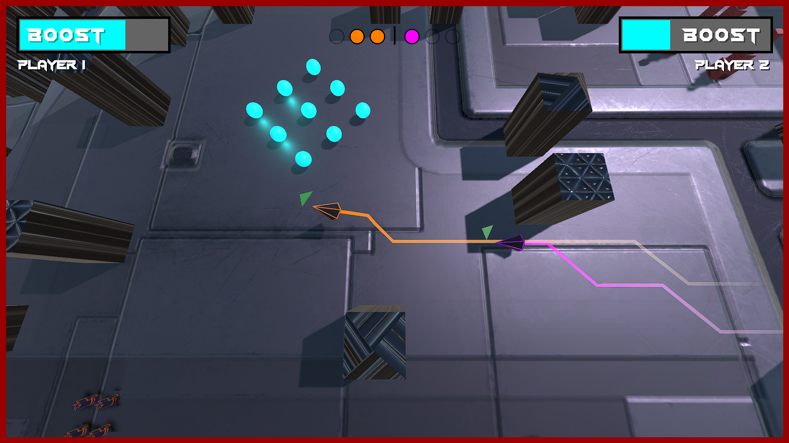

## About

Play Defunct 2 by downloading the [latest release](https://github.com/The-breakbar/Defunct-2/releases/latest).

Defunct 2 is a 1v1 local-coop racing game, where you race eachother to checkpoints, while avoiding obstacles and outpacing your opponent using boost. However, reaching the checkpoints doesn't reward any points, the main objective is to outpace your opponent so much, that they go out of the screen, eliminating them. First player to reach 3 points wins.

Defunct 2 is the spiritual successor to Defunct, a previous unfinished project which was never published. Additionally, the "2" emphasizes the 2-player aspect of the game.

## Controls

Player 1 controls:

- Movement: W, A, S, D
- Boost: Left Shift
- Jump: Space

Player 2 controls:

- Movement: Arrow keys
- Boost: `,` (comma)
- Jump: `.` (period)

Pressing escape pauses the game, allowing you to customize the player colors.
